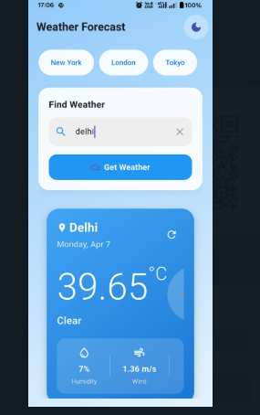
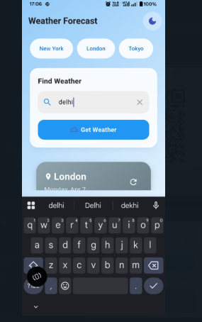
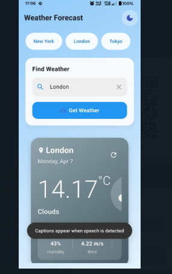
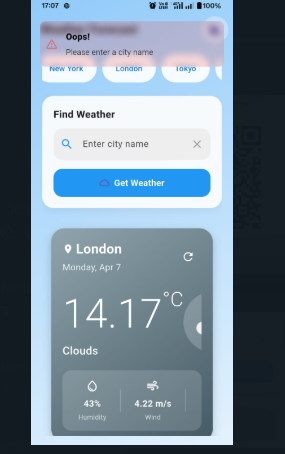

# 🌦️ Flutter Weather App

A clean and responsive weather application built using **Flutter** and **GetX** for state management. This app fetches real-time weather data for any city using the **OpenWeatherMap API** and displays details like temperature, humidity, wind speed, and weather conditions.

---

## ✨ Features

✅ **City Search**
- Input field to enter city name
- Fetches weather data on search

✅ **Weather Information**
- City name
- Temperature in Celsius (°C)
- Weather condition with icon
- Humidity and wind speed

✅ **User Experience**
- Clean and responsive UI
- Loading indicator during fetch
- Error handling (e.g. invalid city, no internet)

✅ **State Management**
- Uses **GetX** for controller-based separation
- Follows clean architecture with separation of logic and UI

✅ **Bonus**
- Saves the last searched city using SharedPreferences
- Dark/Light mode toggle with persistent theme

---

## 🚀 How to Use

1. Enter a city name in the input field and press search.  
   The app will display the current weather info for that city.

That’s it! Super simple and fast ⚡

---

## 📦 Installation & Build

### Prerequisites

- Flutter SDK (>= 3.10.0)
- Android Studio / VS Code
- OpenWeatherMap API Key: [https://openweathermap.org/api](https://openweathermap.org/api)

lib/
├── bindings/
│   └── weather_binding.dart
├── controllers/
│   └── weather_controller.dart
├── models/
│   └── weather_model.dart
├── services/
│   └── weather_service.dart
├── views/
│   ├── home_page.dart
│   └── widgets/
│       ├── weather_card.dart
│       └── search_bar.dart
└── main.dart
Made with ❤️ by Prerit Saini
🔗 LinkedIn – Prerit Saini

